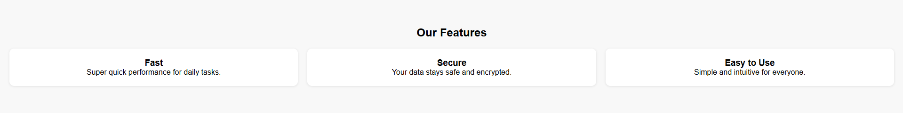

SmartProduct Landing Page
A clean and modern landing page built using HTML, CSS, and JavaScript.
This project showcases core frontend skills such as layout design, responsive UI, and component structuring.

🔥 **Live Demo:** https://cellamuhlis.github.io/landing-page-smartproduct/

📸 Project Preview
⭐ Hero Section

🔍 Features Section

💬 Testimonials Section

## 🚀 Features
- Responsive layout  
- Smooth and clean UI  
- Modern gradient hero area  
- Feature cards with shadows  
- Simple testimonials section  
- Easy to customize

🛠 Tech Stack
- **HTML5** — Structure  
- **CSS3** — Styling & layout  
- **JavaScript** — Interactivity  

📁 Project Structure
/landing-page-smartproduct
│── index.html
│── style.css
│── script.js
│── hero.png
│── features.png
│── testimonials.png
└── README.md

📌 Features
Fully responsive layout
Clean and minimalistic UI
Modern section design
Reusable components

---

## 📌 About This Project

This landing page is a portfolio project created to demonstrate foundational frontend skills.  
It is suitable for:

- Junior Frontend Developer applications  
- Freelance web development profile (Upwork, Fiverr, LinkedIn)  
- Showcasing HTML/CSS/JS ability  
- Entry-level coding portfolio pieces  

## 📞 Contact

If you would like to view more projects or collaborate, feel free to connect:
- GitHub: https://github.com/cellamuhlis  
- Live Demo: https://cellamuhlis.github.io/landing-page-smartproduct/

